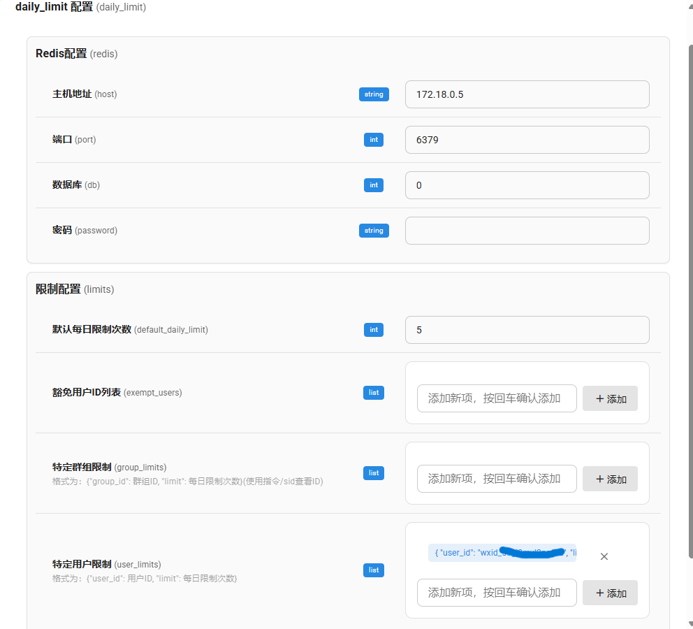
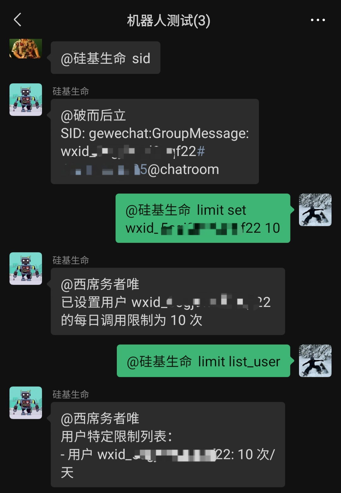
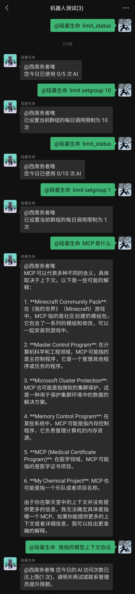

# AstrBot 日调用限制插件

## 简介

每日调用限制插件用于限制群组成员每日调用大模型的次数，帮助管理员控制AI资源的使用。该插件支持为不同用户和群组设置不同的调用限制，并提供豁免机制，让特定用户不受限制。


## 安装要求

- 支持AstrBot的版本: v3.5.1+
- Python 3.10+
- Redis 服务器
- 依赖包：redis >= 4.5.0

## 注意事项

- 插件需要Redis服务器才能正常工作, 还需要安装redis包（pip install redis）
- 豁免用户不受任何调用限制
- 用户的调用限制优先级：豁免用户 > 用户特定限制 > 群组特定限制 > 默认限制

## 配置说明

插件配置文件包含以下主要部分：

### 配置界面


### Redis配置

```json
"redis": {
    "host": "localhost",  // Redis服务器地址
    "port": 6379,         // Redis服务器端口
    "db": 0,              // Redis数据库编号
    "password": ""        // Redis密码（如果有）
}
```

### 限制配置

```json
"limits": {
    "default_daily_limit": 20,  // 默认每日限制次数
    "exempt_users": [],         // 豁免用户ID列表
    "group_limits": [],         // 特定群组限制
    "user_limits": []           // 特定用户限制
}
```

#### 特定群组限制格式

```json
{
    "group_id": "群组ID",
    "limit": 每日限制次数
}
```

#### 特定用户限制格式

```json
{
    "user_id": "用户ID",
    "limit": 每日限制次数
}
```

## 使用方法

### 用户命令

- `/limit_status` - 查看当前用户的调用使用情况

### 管理员命令

- `/limit help` - 显示帮助信息
- `/limit set <用户ID> <次数>` - 设置特定用户的调用限制
- `/limit setgroup <次数>` - 设置当前群组的调用限制
- `/limit exempt <用户ID>` - 将用户添加到豁免列表
- `/limit unexempt <用户ID>` - 将用户从豁免列表移除
- `/limit list_user` - 列出所有用户特定限制
- `/limit list_group` - 列出所有群组特定限制

### 使用演示




## 版本信息

- 版本：v1.0.1
- 作者：left666
- 仓库：https://github.com/left666/astrbot_plugin_daily_limit
